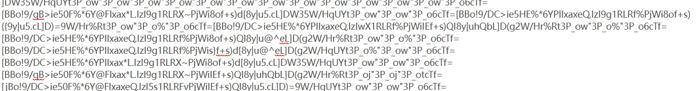
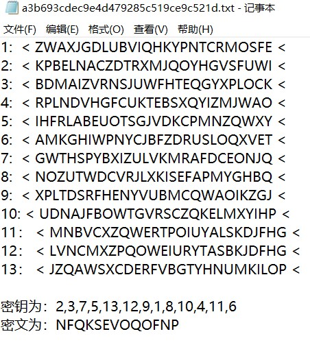

# caeser

枚举网站[凯撒(Caesar)加密/解密 - Bugku CTF](https://ctf.bugku.com/tool/caesar)
枚举脚本：
```
data=input("请输入明文：")  
for i in range(26):  
    print("偏移量为{i}:".format(i=i), end="")  
    for j in data:  
        if j=='{' or j=='}' or j=='_':  
            print(j,end='')  
            continue  
        if (ord(j) - i < 97):  
            j = chr(ord(j) + 26)  
        print(chr(ord(j)-i),end="")  
    print()
```

## ROT13（有rot5、13、18、47）

为恺撒密码密钥为13时的密码，因为其确定性，多用于作为密码的中介

在线网站：[ROT13加密/解密 - ROT13编码/解码—LZL在线工具 (lzltool.cn)](https://lzltool.cn/Tools/Rot13)

# 佛曰密码

需多试几个网站
在线解密网站

[与佛论禅 (keyfc.net)](https://www.keyfc.net/bbs/tools/tudoucode.aspx)这个网站需要在前面加`佛曰：`或者`如是我闻：`

[与佛论禅 (talk-with-buddha.netlify.app)](https://talk-with-buddha.netlify.app/)前面加`佛又曰：`


# base家族
BASE16
编码后的字符只会**0-9，A-F共16个**中出现，编码后的字符为源字符的两倍，4个bit一组，而1字节8bit，所以base16不可能用到等号填充。

BASE32
编码后的字符只会在**大写字母（A-Z）和数字234567 32个字符**组成，因为base32 5bit为一组，所以编码长度必须是40bit的倍数（5和8的最小公倍数）

因为必须为40bit的倍数，所以如果不足的话，会在第一个不满足5bit的小组进行补0，然后进行编码，在结果补上占位符=，一个等号5bit，最多出现6个0 1 3 4 6

BASE64
编码后的字符只会在**A-Z a-z 0-9（共62个）另外加上+/两个符号**。3个字节由4个base64单元来表示，很高的编码效率了。

如果要编码的字节数不能被3整除，最后会多出1个或2个字节，则用占位符= （一个代表一个字节）所以最多出现两个等号

BASE91

编码字符含有：
`!#$%&'()*+,-./0123456789:;<=>?@ABCDEFGHIJKLMNOPQRSTUVWXYZ\[\]^_abcdefghijklmnopqrstuvwxyz{|}`
形如：


## 栅栏密码

竖型
```
def zhalan(e,number):  
    result = {x: '' for x in range(number)}  
    for i in range(len(e)):  
        a = i % number  
        result.update({a: result[a] + e[i]})  
    d = ""  
    for i in range(len(result)):  
        d = d + result[i]  
    print(d,"密钥为：",number)  
  
if __name__ == '__main__':  
    str = input("请输入要解密的字符串：")  
    for i in range(1,len(str)):  
        zhalan(str,i)
```


W型

[栅栏密码_栅栏密码在线加密解密【W型】-ME2在线工具 (metools.info)](http://www.metools.info/code/fence154.html)


## 幂数加密

由于英文字母只有26个字母，由公式可知，只要2的0、1、2、3、4次幂就可以表示31个单元。通过用二进制幂数表示字母序号数来加密。例如

明文： d o n o t p u l l a l l y o u r e g g s i n o n e b a s k e t

字母序号：4 15 14 15 20 16 21 12 12 1 12 12 25 15 21 18 5 7 7 19 9 14 15 14 5 2 1 19 11 5 20

由于4=2^2 所以D加密过之后是2；15=2^0+2^1+2^2+2^3所以O加密后是0123。

# 01248云影密码

有1，2，4，8这四个数字，可以通过加法来用这四个数字表示0-9中的任何一个数字，列如0=28， 也就是10=2+8，同理7=124， 9=18。这样之后再用1-26来表示26个英文字母，就有了密文与明文之间的对应关系。引入0来作为间隔，以免出现混乱。所以云影密码又叫“01248密码”

## jother编码

例如：`[][(![]+[])`

[JSFuck - 在线加解密 (bugku.com)](https://www.bugku.com/tools/jsfuck/)

## 培根密码

只有AB的密码
[培根密码解密_培根密码转换器-ME2在线工具 (metools.info)](http://www.metools.info/code/bacon193.html)

有两种转换的规则，都需要试试

## 转轮机加密



## 键盘加密

即输入键盘，然后圈住的密码，或者在电脑上敲出的图案

## 兔子加密

首行为U2F(有可能)，有点像BASE64转图片
[Rabbit加密-Rabbit解密-在线Rabbit加密解密工具 (woodmanzhang.com)](https://www.woodmanzhang.com/webkit/rabbitencrypt/index.html)

## OK加密

有很多·`. ! ?`
[Brainfuck/Text/Ook! obfuscator - deobfuscator. Decode and encode online. (bugku.com)](https://tool.bugku.com/brainfuck/?wafcloud=1)

## 十六进制转字符串

[16进制转换，16进制转换文本字符串，在线16进制转换 | 在线工具 (sojson.com)](https://www.sojson.com/hexadecimal.html)

## 文字倒叙

[文字倒序工具,在线文字倒序 (qqxiuzi.cn)](https://www.qqxiuzi.cn/zh/daoxu/)

