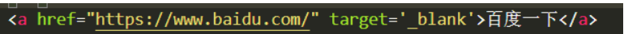

## 标签

#### a标签：

a标签是一个跳转标签，控制页面之间的跳转。href属性里设置跳转页面的路径，target属性里设置是在当前页面跳转还是新建页面跳转。target默认属性为_self（在当前页面跳转），设置为_blank则表示要新建页面跳转。title属性为鼠标悬停时展示的信息
 
 另外使用a 标签还有以下几点要注意：<br>
1.a标签不仅可以让文字点击，也可以让图片被点击<br>​
2.一个a标签必须有一个href属性，否则a标签不知道要跳转到什么地方<br>
3.如果通过a标签href属性指定一个URL地址，那么必须在地址前面加上http://或者https:// ​ 除了URL地址，还可以指定一个本地地址

##### 常见url编码

```
Character               Encoding

space                    %20

!                        %21

"                        %22

#                        %23

$                        %24

%                        %25

&                        %26

'                        %27

(                        %28

)                        %29
```