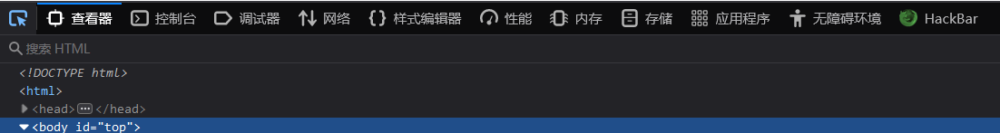

# 快捷键

Ctrl+Shift+N→以隐身模式创建新窗口

Ctrl+U是显示网页源码：

最左边的按钮，直接选中元素


**禁止脚本**
```
在火狐浏览器url界面输入about:config

2.在搜索框中输入JavaScript，找到javascript.enabled将其转换为false
```

**intext:**

寻找正文中含有关键字的网页，例如： **intext:后台登录** 将只返回正文中包含 后台登录 的网页

**intitle:**

寻找标题中含有关键字的网页，例如： **intitle:后台登录** 将只返回标题中包含 后台登录 的网页，**intitle:后台登录 密码** 将返回标题中包含黑客而正文中包含中国的网页


**allintitle:**

用法和intitle类似，只不过可以指定多个词，例如： **alltitle:后台登录 管理员** 将返回标题中包含黑客 和中国的网页

**inurl：**

将返回url中含有关键词的网页：例如：**inurl:Login** 将返回url中含有 Login 的网页

查找管理员登录页面inurl:/admin/login.php

查找后台数据库管理页面inurl: /phpmyadmin/index.php

**allinurl:**

用法和inurl类似，只不过可以指定多个词，例如：**inurl:Login admin** 将返回url中含有 Login 和 admin 的网页

**site:**

指定访问的站点，例如： **site:[http://baidu.com](https://link.zhihu.com/?target=http%3A//baidu.com) inurl:Login** 将只在[http://baidu.com](https://link.zhihu.com/?target=http%3A//baidu.com) 中查找url中含有 Login的网页

**filetype:**

指定访问的文件类型，例如：**site:[http://baidu.com](https://link.zhihu.com/?target=http%3A//baidu.com) filetype:pdf** 将只返回[http://baidu.com](https://link.zhihu.com/?target=http%3A//baidu.com)站点上文件类型为pdf的网页

**link:**

指定链接的网页，例如：**link:[http://www.baidu.com](https://link.zhihu.com/?target=http%3A//www.baidu.com)** 将返回所有包含指向 [http://www.baidu.com](https://link.zhihu.com/?target=http%3A//www.baidu.com) 的网页

**related:**

相似类型的网页，例如：**related:[http://www.xjtu.edu.cn](https://link.zhihu.com/?target=http%3A//www.xjtu.edu.cn)** 将返回与 [http://www.xjtu.edu.cn](https://link.zhihu.com/?target=http%3A//www.xjtu.edu.cn) 相似的页面，相似指的是网页的布局相似

**cache:**

网页快照，谷歌将返回给你他存储下来的历史页面，如果你同时制定了其他查询词，将在搜索结果里以高亮显示，例如：**cache:[http://www.hackingspirits.com](https://link.zhihu.com/?target=http%3A//www.hackingspirits.com) guest** ，将返回指定网站的缓存，并且正文中含有guest

**info:**

返回站点的指定信息，例如：info:[http://www.baidu.com](https://link.zhihu.com/?target=http%3A//www.baidu.com) 将返回百度的一些信息

**define:**

返回某个词语的定义，例如：define:Hacker　　将返回关于Hacker的定义

**查找网站后台**

- site:[http://xx.com](https://link.zhihu.com/?target=http%3A//xx.com) intext:管理
- site:[http://xx.com](https://link.zhihu.com/?target=http%3A//xx.com) inurl:login
- site:[http://xx.com](https://link.zhihu.com/?target=http%3A//xx.com) intitle:后台

**查看服务器使用的程序**

- site:[http://xx.com](https://link.zhihu.com/?target=http%3A//xx.com) filetype:asp
- site:[http://xx.com](https://link.zhihu.com/?target=http%3A//xx.com) filetype:php
- site:[http://xx.com](https://link.zhihu.com/?target=http%3A//xx.com) filetype:jsp
- site:[http://xx.com](https://link.zhihu.com/?target=http%3A//xx.com) filetype:aspx

**查看上传漏洞**

- site:[http://xx.com](https://link.zhihu.com/?target=http%3A//xx.com) inurl:file
- site:[http://xx.com](https://link.zhihu.com/?target=http%3A//xx.com) inurl:load