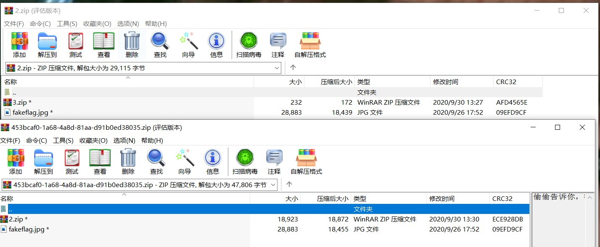

# 伪加密

压缩源文件目录区：

-   50 4B 01 02：目录区文件头标记
-   1F 00：压缩使用的 pkware 版本 或3F 00
-   14 00：解压文件所需 pkware 版本
-   00 00：全局方式位标记（伪加密，改为 09 00 就提示有密码了）

**无加密**  
数据区 的全局加密应当为 00 00  
目录区 的全局方式位标记应当为 00 00

**假加密**  
数据区 的全局加密应当为 00 00  
目录区 的全局方式位标记应当为 09 00

**真加密**  
数据区 的全局加密应当为 09 00  
目录区 的全局方式位标记应当为 09 00

有时候最好都改为00 00

# binwalk查看foremost分离

## binwalk

binwalk工具的命令

binwalk -e 文件名

可以无视伪加密，直接从压缩包中提取文件

binwalk查看foremost分离

# ARCHPR_v4.55爆破

注意看有一些有提示

### 明文爆破

对于zip文件来说，进行明文攻击的`条件`是：有一个单独的文件已知且进行压缩之后的[CRC](https://so.csdn.net/so/search?q=CRC&spm=1001.2101.3001.7020)值与某个包含此文件的压缩包的CRC值相等

两个文件图片CRC32码相同，将jpg文件通过winrar压缩成zip文件

然后进行明文解密，有时可以提前结束

# 压缩包修复

## RAR结构

RAR通常情况比ZIP压缩比高，但压缩/解压缩速度较慢

[RAR文件格式分析 | Sp4n9x's Blog](https://sp4n9x.github.io/2020/04/10/RAR%E6%96%87%E4%BB%B6%E6%A0%BC%E5%BC%8F%E5%88%86%E6%9E%90/)

- `HEAD_TYPE = 0x72` - MARK_HEAD(标记块)
- `HEAD_TYPE = 0x73` - MAIN_HEAD(压缩文件头)
- `HEAD_TYPE = 0x74` - FILE_HEAD(文件头)
- `HEAD_TYPE = 0x75` - COMM_HEAD(旧风格的注释头)
- `HEAD_TYPE = 0x76` - AV_HEAD(旧风格的授权信息块/用户身份信息块)
- `HEAD_TYPE = 0x77` - SUB_HEAD(旧风格的子块)
- `HEAD_TYPE = 0x78` - PROTECT_HEAD(旧风格的恢复记录)
- `HEAD_TYPE = 0x79` - SIGN_HEAD(旧风格的授权信息块/用户身份信息块)
- `HEAD_TYPE = 0x7A` - NEWSUB_HEAD(子块)
- `HEAD_TYPE = 0x7B` - ENDARC_HEAD(结束块)