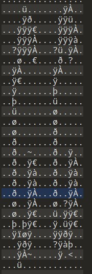

# 建议不管什么文件先010打开查找flag{

# 修改高或宽

# binwalk

有时候binwalk出不来，但可以直接foremost出来

# zsteg

```
使用命令 git clone http://www.github.com/zed-0xff/zsteg
apt-get install gem
gem install zsteg
若报错，先更新
apt-get update
apt-get upgrade
gem install zsteg
```

# Stegsolve

File Format:文件格式

Data Extract:数据提取

Steregram Solve:立体试图 可以左右控制偏移

Frame Browser:帧浏览器,可用于gif

Image Combiner:拼图，图片拼接


# gif抽帧
在线网站[Online GIF to sprite sheet converter (ezgif.com)](https://ezgif.com/gif-to-sprite)

脚本（还没试过）
```
from PIL import Image, ImageSequence

with Image.open("girls-min.gif") as im:
    index = 1
    for frame in ImageSequence.Iterator(im):
        frame.save(f"girl{index}.png")
        index += 1

```

# Jphswin

jpeg类型解码

# 补全二维码

# PS可能有几层图层

# ascii art（字符画生成）



## 图片拼接

[图片拼接-合并或拼接图片 - 在线工具 (wqtool.com)](https://www.wqtool.com/imgmerging)

http://www.atoolbox.net/Tool.php?Id=978