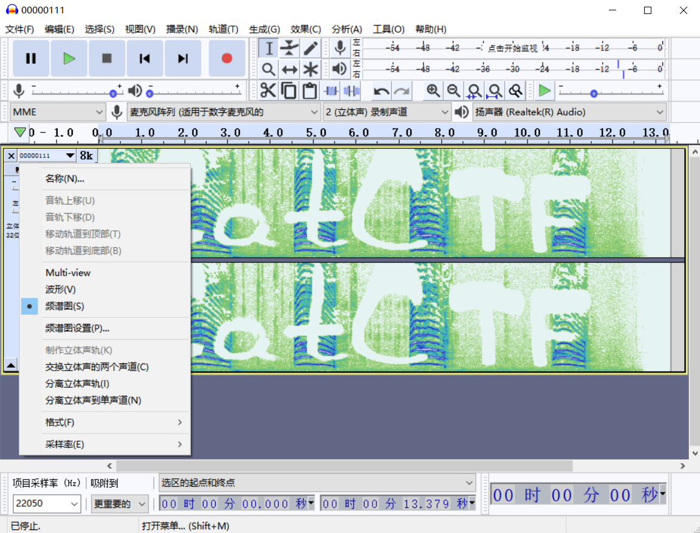

# audacity

打开频谱图进行分析

# deepsound

有可能需要密钥打开，本机得到文件后会导入DATA文件夹

# 拨号隐写

经常打10086的时候对方可能说需要XX服务请按1，需要XX服务请按2，对于不同的数字有不同的声音，就可以隐写一些数据。可以通过DTMF提取出来

DTMF脚本地址：[https://github.com/ribt/dtmf-decoder](https://github.com/ribt/dtmf-decoder)

# MP3隐写

使用工具：mp3stego