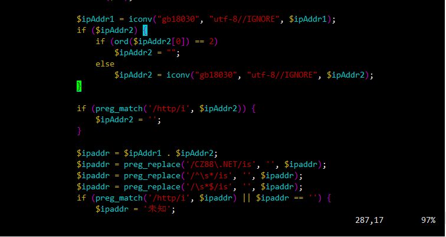
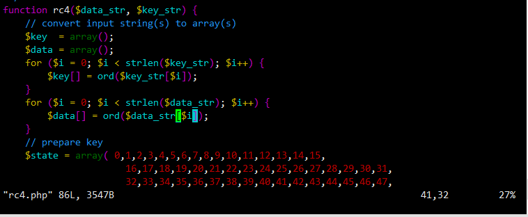
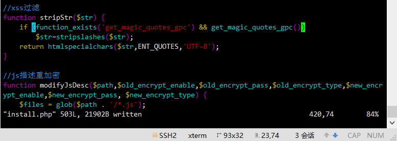

修改function.php中283中`if (ord($ipAddr2{0}) == 2)`改为`if (ord($ipAddr2[0]) == 2)`即可


在rc4.php的38行和41行同样改为方括号

将不再支持使用花括号的数组和字符串偏移访问语法" 表明你正在使用已被弃用的花括号语法来访问字符串偏移量。这个语法在 PHP 7.4 中被弃用，并且在 PHP 8.0 及更高版本中不再支持



将install.php中430行改为
```
function stripStr($str) {
    if (function_exists('get_magic_quotes_gpc') && get_magic_quotes_gpc())
        $str=stripslashes($str);
    return htmlspecialchars($str,ENT_QUOTES,'UTF-8');
}

```
`get_magic_quotes_gpc()` 函数的作用是检查是否启用了魔术引号（magic quotes）。魔术引号是一种过时的安全特性，它在 PHP 5.3 中被弃用，然后在 PHP 5.4 中被移除。因此，没有直接的替代函数，因为在现代 PHP 版本中不再需要它。