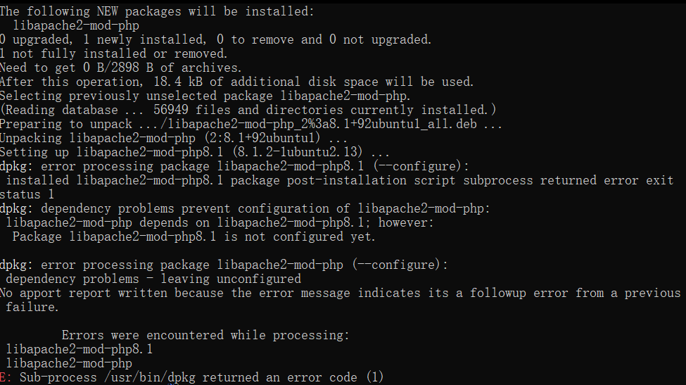
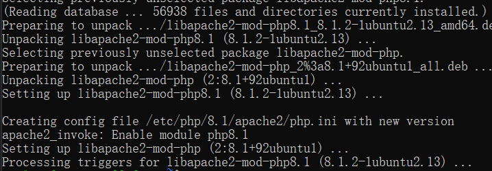

强制删除错误配置的软件包：运行以下命令以强制删除错误配置的软件包：
```
sudo dpkg --remove --force-remove-reinstreq libapache2-mod-php8.1
sudo dpkg --remove --force-remove-reinstreq libapache2-mod-php
```

清理未配置的软件包：运行以下命令以清理未配置的软件包：
```
sudo dpkg --configure -a
```

重新安装
```
sudo apt update
sudo apt install libapache2-mod-php
```



成功解决