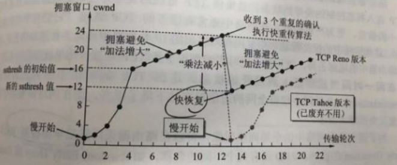

# TCP和UDP的区别

	TCP 面向连接，传输是可靠的，保证了数据的正确性和数据顺序，以字节流的形式进行传输，实际上是TCP把数据看成一连串无结构的字节流，由于TCP提供可靠性保证，它在传输过程中会引入一定的开销，如连接建立、序列号确认、拥塞控制等
	UDP 面向无连接，传输不可靠，可能会出现丢包、UDP不能保证数据的发送顺序,以数据报文段的形式进行传输，UDP是面向报文的，UDP没有拥塞控制，传输速度较快，效率较高

# TCP 延伸

	特点：TCP 是面向连接的运输层协议，应用程序在使用 TCP 协议之前，必须先建立 TCP 连接，在传送数据完毕后，必须释放已经建立的 TCP 连接，每一条 TCP 连接只能有两个端点，每一条 TCP 连接只能是点对点的(一对一)，TCP 提供可靠交付的服务，通过 TCP 连接传送的数据，无差错、不丢失、不重复，并且按序到达，TCP 提供全双工通信，TCP 允许通信双方的应用进程在任何时候都能发送数据，TCP 连接的两端都设有发送缓存和接受缓存，用来临时存放双向通信的数据 ，面向字节流，TCP 中的“流”指的是流入到进程或从进程流出的字节序列
	每一条 TCP 连接唯一地被通信两端的两个端点(即两个套接字)所确定，TCP 连接 ::= {socket1, socket2} = {(IP1: port1), (IP2: port2)} ，TCP 连接就是由协议软件所提供的一种抽象。TCP 连接的端口是个很抽象的套接字，即( IP地址: 端口号)，同一个 IP 地址可以有多个不同的 TCP 连接，而同一个端口号也可以出现在多个不同的 TCP 连接中

# TCP中为什么要进行流量控制，怎么进行的流量控制

	为了确保发送方不会以过快的速度向接收方发送数据，从而防止接收方无法及时处理或丢弃过多的数据,流量控制的机制在TCP中通过滑动窗口（Sliding Window）来实现
	滑动窗口机制的工作原理，我们假定数据传输只在一个方向上进行，A(发送方) —> B(接收方)，即 A 发送数据，B 接收数据并给出确认。
	发送方发送数据时不再是一次只发送一个TCP报文段，而是一次连续发送多个报文段。也就是说，发送方在发送了一个段之后不必一直等待这个段的确认应答，而是继续发送下一个报文段。每当收到一个报文段的确认应答后，窗口就向前滑动一个报文段的长度，因为已发送并收到确认应答的报文段不需要再保留在窗口中了，但已发送还未收到确认应答的段还必须保留在窗口中，以便在超时重传时使用。需要注意的是，滑动窗口是以字节为单位向前滑动的

# TCP中为什么要进行拥塞控制，如何进行拥塞控制

	为了确保网络中的传输负载不超过网络的容量，防止网络拥塞和拥堵的发生，从而保证数据的可靠传输和网络的稳定性，拥塞控制往往是一种全局的，防止过多的数据注入到网络之中，而TCP连接的端点只要不能收到对方的确认信息，猜想在网络中发生了拥塞，但并不知道发生在何处，因此，流量控制往往指点对点通信量的控制，是端到端的问题
	通过拥塞控制算法实现：
	慢启动：在连接刚建立时，发送方以较小的发送窗口开始发送数据，然后每经过一个往返时间，发送窗口大小就加倍。这样可以逐渐增加发送速率，直到网络开始出现拥塞
	拥塞避免：一旦网络开始出现拥塞，发送方进入拥塞避免阶段，发送窗口的增长速率减慢，每经过一个RTT，发送窗口大小仅增加一个MSS的数据量
    快重传：当发送方连续接收到重复的确认信息（ACK）时，可以判断某个数据包丢失，发送方会立即重传该丢失的数据包，而不需要等待超时时间
    快恢复：在进行快速重传后，发送方将进入快速恢复阶段。发送窗口的大小被减半，并且发送方继续以较小的速率发送数据，而不是回到慢启动阶段

 
# 简述SYN洪水的原理，有没有防御方法？

	SYN洪水攻击是利用客户端和服务端建立TCP连接，服务器必须收到客户端返回的一个ACK包才完成建立连接，否则一直处于等待的缺陷，连续发送SYN报文给服务器端请求建立TCP连接，却不回应（这种情况称为半开连接），当半开连接数达到系统允许的最大值时，系统不再接受建立连接请求，即后面的用户无法访问到服务器，拿网站服务器来说就是无法打开网页；最终还可能耗尽服务器的 CPU 和内存，使服务器彻底瘫痪
	防御方法：
	SYN Cookies：服务器启用SYN Cookies机制，将部分连接信息隐藏在加密的cookie中，避免在连接请求阶段消耗过多资源，这样即使收到大量伪造的SYN请求，服务器可以通过验证SYN Cookies来节约资源
	负载均衡：使用负载均衡器将流量分散到多个服务器上，减轻单一服务器的负担，提高系统的容量和弹性，可以通过硬件设备（负载均衡机、交换机）、软件、DNS（不同IP）、CDN、防火墙
    增加并发连接数：服务器可以增加可以处理的并发连接数，使其能够承受更多的连接请求
    流量过滤：通过防火墙或入侵检测系统（IDS）进行流量过滤，识别和阻止来自恶意源IP地址的大量SYN请求
    SYN代理：部署专门的SYN代理服务器，接收所有的SYN请求并完成三次握手，只将已建立的连接请求转发给目标服务器。这样可以分担目标服务器的负担，同时过滤掉大部分恶意的SYN请求
    防火墙优化：优化防火墙规则，限制单个IP地址或IP地址段的连接速率，防止大量SYN请求集中在较短时间内到达服务器

# UDP 延伸

	UDP 是一个简单的面向消息的传输层协议，是基于IP的简单的，不可靠的协议，面向报文，简单，轻量化，但没有拥塞控制，没有应答确认机制，不能解决丢包、重发、错序问题，尽最大努力交付，不保证可靠交付。不过并不是所有使用UDP协议的应用层都是不可靠的，应用程序可以自己实现可靠的数据传输，通过增加确认和重传机制，所以使用UDP 协议最大的特点就是速度快

# 为什么HTTP/3使用基于UDP的QUIC？（握手，队头阻塞）

	QUIC 全称快速UDO互联网连接：
	通过使用类似 TCP 快速打开的技术，缓存当前会话的上下文，在下次恢复会话的时候，只需要将之前的缓存传递给服务端验证通过就可以进行传输了，简称0RTT建连，即传输层 0RTT 就能建立连接。加密层 0RTT 就能建立加密连接（首次连接为1RTT）
	可以多路复用，解决对头阻塞问题，QUIC 协议是基于 UDP 协议实现的，同一个 QUIC 连接上可以创建多个 stream（数据流） 来发送多个 HTTP 请求，并且，多个 stream 之间没有依赖，传输的单个 stream可以保证有序交付且不会影响其他的数据流
	向前纠错机制，每个数据包除了它本身的内容之外，还包括了部分其他数据包的数据，因此少量的丢包可以通过其他包的冗余数据直接组装而无需重传
	QUIC 的 packet 除了个别报文比如 PUBLIC_RESET 和 CHLO，所有报文头部都是经过认证的，报文 Body 都是经过加密的
	QUIC协议基于UDP实现摒弃了五元组的概念，使用64位的随机数作为连接的ID，并使用该ID表示连接，我们在日常wifi和流量切换时，或者不同基站之间切换都不会重连，从而提高业务层的体验
	HTTP/3选择基于UDP的QUIC协议,可以有效地解决综上问题，从而提高网络性能和用户体验

# 列举一个基于UDP的反射攻击的原理？

	在UDP协议中，正常情况下，客户端发送请求包到服务器，服务器返回响应包给客户端，一次交互就已完成，中间没有校验过程。反射攻击正是利用了UDP协议面向无连接、缺少源认证机制的特点，将请求包的源IP地址篡改为攻击目标的IP地址，最终服务器返回的响应包就会被送到攻击目标，形成反射攻击
	攻击者通常利用互联网的基础架构来放大攻击。由于网络中开放的NTP服务器非常多，攻击者会利用僵尸主机同时向NTP服务器发起大量的Monlist请求，1个Monlist请求包可以引发100个响应包。通常1个NTP请求包只有90字节的大小，而1个回应报文通常为482字节，100个回应报文就是48200字节，可以发现回应报文是请求报文的500倍左右，这就形成了四两拨千斤的放大攻击，最终造成链路拥塞甚至网络瘫痪

# NAT：为什么需要NAT，如何穿透NAT？

	主要还是IP地址的不足，使用少量的公有IP地址代表较多的私有IP 地址的方式，将有助于减缓可用的IP地址空间的枯竭，其次能够有效地避免来自网络外部的攻击，隐藏并保护网络内部的计算机
	完全锥形（Full Cone）NAT
	处于不同内网的主机A和主机B，各自先连接服务器，从而在各自NAT设备上打开了一个“孔”，服务器收到主机A和主机B的连接后，知道A与B的公网地址和NAT分配给它们的端口号，然后把这些NAT地址与端口号告诉A与B，由于在完全锥形NAT的特点，A和B给服务器所打开的“孔”，能给别的任何的主机使用。故A与B可连接对方的公网地址和端口直接进行通信。服务器在这里充当“介绍人”，告诉A与B对方的地址和端口号
	受限制锥形（Restricted Cone）NAT
	A和B还是要先连接服务器，服务器发送A和B的地址和端口信息给A和B，但由于受限制锥形NAT的特 点，他们所打开的“孔”，只能与服务器通信。要使他们可以直接通信，解决办法如下：假如主机A开始发送一个UDP信息到主机B的公网地址上，与此同时，它又通过服务器中转发送了一个邀请信息给主机B，请求主机B也给主机A发送一个UDP信息到主机A的公网地址上。这时主机A向主机B的公网IP发送的信息导致NAT A打开一个处于主机A的和主机B之间的会话，与此同时，NAT B也打开了一个处于主机B和主机A的会话。一旦这个新的UDP会话各自向对方打开了，主机A和主机B之间就可以直接通信了
	对称型（Symmetric）NAT
	对称型NAT，对于不同的外网主机地址，它都会分配不同的端口号，所以进行UDP打孔比较困难，但也可以进行端口预测打孔，不过不能保证成功。
	花生壳NAT-DDNS穿透
	花生壳DDNS是将用户的动态IP 地址映射到一个固定的域名上，用户每次连接网络的时候客户端程序就会通过信息传递把该主机的动态IP 地址传送给位于服务商主机上的服务器程序，服务项目器程序负责提供 DNS 服务并实现动态域名解析。DDNS 的主要作用就是捕获用户每次变化的 IP 地址，然后将其与域名相对应，这样其他上网用户就可以通过域名来与用户交流了

# 虚拟机和容器的区别

	虚拟机：虚拟机是一种完整的虚拟计算机，包括操作系统、应用程序和所有必要的系统库。它在物理服务器上通过虚拟化软件创建和运行。每个虚拟机都有自己的独立操作系统内核和资源管理器，它们被隔离在虚拟化层之上，使得每个虚拟机可以运行不同的操作系统和应用程序，通常需要较大的系统资源，包括内存和存储空间，每个虚拟机都需要独立运行完整的操作系统，且虚拟机的启动时间较长
	容器：容器是一种轻量级的虚拟化技术，它利用操作系统层面的虚拟化实现，容器共享主机操作系统内核，并在其上运行应用程序和相关依赖项，而不需要为每个容器提供独立的操作系统，容器的启动时间较短，资源消耗更低，容器之间是相互隔离的，通过使用命名空间和控制组技术来提供资源隔离和安全性

# 一型虚拟机和二型虚拟机的区别
	一型虚拟机直接运行在系统硬件上，创建硬件全仿真实例，被称为“裸机”型，直接访问硬件资源，没有操作系统层介入，由于没有操作系统层的额外开销，一型虚拟机通常在性能上略优于二型虚拟机，而且由于它们没有运行在操作系统上，一型虚拟机通常被认为在安全性方面更有优势
	二型虚拟机运行在操作系统上，同样创建的是硬件全仿真实例，被称为“托管（宿主）”型，依赖于一个宿主操作系统来提供硬件资源的抽象，二型虚拟机相对灵活，更适合桌面虚拟化和云计算等通用用途

# 简述Docker如何实现容器间的资源隔离

1. 命名空间：Linux 命名空间是一种将全局系统资源隔离为独立视图的技术。Docker 使用了多个命名空间来隔离不同的系统资源
2. 控制组：Linux 控制组是一种可以限制、账户和隔离进程组资源使用的机制。Docker 使用 cgroups 来限制容器对 CPU、内存、磁盘、网络等资源的使用。通过 cgroups，Docker 可以限制容器对宿主机资源的访问，确保一个容器不会耗尽所有资源，从而影响其他容器的性能。
3. 文件系统：Docker 使用联合文件系统将容器镜像和容器的写入层进行分离。这使得容器可以在只读的基础镜像上添加一个可写层，所有对文件系统的修改都会被记录在这个可写层上。因此，每个容器都拥有自己独立的文件系统空间，避免了相互干扰。

# 如何实现Docker逃逸（API未授权、docker.sock挂载、特权模式逃逸、内核漏洞逃逸、资源隔离不完全造成的逃逸、Docker本身存在漏洞）

# 常用于Web开发的语言和框架，列举一些这些框架历史上比较有影响的漏洞
# Web开发中MVC架构是什么
# 前后端分离开发中，前后端通信会使用RESTAPI（表层状态转换）规范，那是什么？
# 为什么需要HTTPS，简述HTTPS握手流程？

# 列举一些常见的Web漏洞及其原理？
# SQL注入原理？什么是二次注入？
# HTTP请求走私原理？
# SSRF攻击原理？（仅限HTTP协议，1. 过滤了127.0.0.1和localhost和局域网10段和172.16段 2.URL解析后检查Host 3. 对每一次请求进行解析，如何绕过）
# 在脚本语言web程序中，如果存在一个任意文件上传时，如何Getshell？（没有Crontab和ssh怎么操作）
# php原生的敏感函数有哪些？
# 介绍下PHP的变量覆盖
# php中三个等号和两个等号有什么区别
# 模板注入的原理？
# 渗透测试基础
# 介绍渗透测试的一般流程和思路
# 是否知道C2，尝试列举一些
# 如何绕过CDN查到站点的真实IP
# 免杀的核心思路是什么？
# 列举一些常见的提权方式？

# 密码学的对称密码与非对称密码有哪些？
# base64原理？

# Burp中Proxy和Reperter的作用是什么？
# nmap是用来干什么的？
# 有哪些常见的漏洞扫描工具？

# 零宽字符隐写原理
# LSB隐写原理